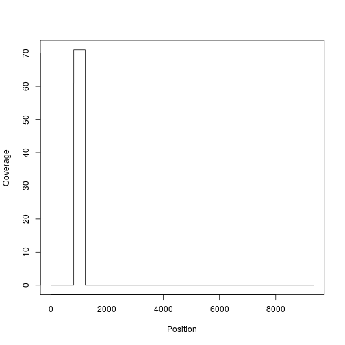

## Align in protein space

Alignment in protein space is potentially more accurate (although not always), but to do so reliably is not straightforward. This makes this section more appropriate for advanced users, who want to automate alignment of potentially difficult sequence datasets.

### Loading libraries


```r
library(Biostrings)
library(seqinr)
library(magrittr)
source("utils.R")
```

## Getting a good translation

First, we have to translate the sequences into amino acids. We can't assume that the sequences are in frame 1, so we have to find the correct frame for each.

### Identifying the right frame by counting stops

The simplest way is to count the number of stop codons in each reading frame.


```r
nucseq.fn <- "ray2000_edited.fas"
nucseq <- read.fasta(nucseq.fn)
```

In ```utils.R```, there is a function that counts the number of stop codons in each frame.


```r
numstops <- lapply(nucseq,countstops)
```

However, when we look at the results, we can see that there is one sequence where there are two frames with no stop codons.


```r
lapply(numstops,paste,collapse=" ") %>% unlist %>% unname %>% table %>% as.data.frame.table
```

```
##        . Freq
## 1  0 3 2    1
## 2  0 3 3    1
## 3  0 3 4    1
## 4  0 3 5    2
## 5  0 4 2    6
## 6  0 4 3   22
## 7  0 4 4    9
## 8  0 4 6    1
## 9  0 5 2    1
## 10 0 5 3    2
## 11 0 5 4    4
## 12 0 6 2    2
## 13 0 6 4    1
## 14 0 6 5    1
## 15 0 7 3    2
## 16 0 7 7    1
## 17 0 8 2    1
## 18 0 8 4    1
## 19 1 4 0    1
## 20 1 5 0    1
## 21 1 5 3    1
## 22 1 6 5    1
## 23 2 3 0    1
## 24 2 4 0    1
## 25 2 6 0    1
## 26 3 3 0    2
## 27 4 3 0    1
## 28 5 0 0    1
## 29 6 4 0    1
```

### Finding open reading frames

Another approach involves finding the longest open reading frame.


```r
nucseq.fn <- "ray2000_edited.fas"
nucseq.orf.fn <- "ray2000_edited.fas.orf"
```

Finding the longest open reading frame greater than a minimum size (say 400 bases) is possible in R, but I have yet to find a solution that is as fast as using an external program. We will use ```getorf``` from the EMBOSS software suite.


```r
cmd <- sprintf("getorf -sequence %s -outseq %s -find 2 -minsize 405",nucseq.fn,nucseq.orf.fn)
system(cmd)
```

Here we can see that we now have one less sequence than before.


```r
nucseq.orf <- read.fasta(nucseq.orf.fn)
length(nucseq.orf)
```

```
## [1] 70
```

### Align to a reference sequence

Another approach is to map to a reference sequence that is in frame. We load in a reference sequence.


```r
subject <- read.fasta("hcv4.fas")[[1]] %>%
  as.character %>%
  toupper %>%
  c2s
subject
```

```
## [1] "TTCACGCAGAAAGCGTCTAGCCATGGCGTTAGTATGAGTGTTGTACAGCCTCCAGGACCCCCCCTCCCGGGAGAGCCATAGTGGTCTTCGGAACCGGTGAGTACACCGGAATCGCCGGGATGACCGGGTCCTTTCTTGGATTAACCCGCTCAATGCCCGGAAATTTGGGCGTGCCCCCGCAAGACTGCTAGCCGAGTAGTGTTGGGTCGCGAAAGGCCTTGCGGTACTGCCTGATAGGGTGCTTGCGAGTGCCCCGGGAGGTCTCGTAGACCGTGCACCATGAGCACGAATCCTAAACCTCAAAGAAAAACCAAACGTAACACCAACCGCCGCCCAATGGACGTTAAGTTCCCGGGTGGTGGCCAGATCGTTGGCGGAGTTTACTTGTTGCCGCGCAGGGGCCCCAGATTGGGTGTGCGCGCGACTCGGAAGACTTCGGAGCGGTCGCAACCTCGTGGAAGACGCCAACCTATCCCCAAGGCGCGTCGACCCGAGGGAAGGTCCTGGGCACAACCAGGATATCCATGGCCTCTTTACGGTAATGAGGGTTGTGGGTGGGCAGGATGGCTCTTGTCCCCCCGTGGCTCTCGACCGTCTTGGGGCCCAAATGATCCCCGCGGGAGGTCCCGCAATTTGGGTAAGGTCATCGATACCCTAACCTGCGGCTTCGCCGACCTCATGGGATACATCCCGCTCGTAGGCGCCCCCGTGGGTAGCGTCGCCAGGGCCCTGGCACATGGTGTCAGGGCTTTGGAGGACGGGATCAATTATGCAACAGGGAATCTCCCCGGTTGCTCCTTTTCTATCTTCCTCTTGGCACTTCTTTCGTGCCTGACTGTCCCCGCTTCGGCCGTTAACTATCGCAATGTCTCAGGCATCTACCATGTCACCAATGACTGCCCGAATTCAAGCATAGTGTATGAGGCCGACCATCACATCATGCACCTTCCAGGTTGCGTGCCCTGCGTGAGAGAGGGGAATCAGTCACGCTGCTGGGTGGCCCTTACTCCTACCGTCGCAGCGCCATACATCGGCGCACCGCTTGAGTCCTTACGGAGTCATGTGGATTTGATGGTGGGGGCCGCCACTGTCTGCTCGGGTCTTTACATCGGGGACCTGTGTGGCGGCTTGTTCCTAGTTGGCCAGATGTTTTCATTCCGACCACGGCGCCACTGGACCACCCAGGATTGCAATTGTTCCATCTACACAGGGCACATTACAGGCCACAGAATGGCCTGGGACATGATGATGAACTGGAGTCCAACAACCACCTTAGTTCTCGCCCAGGTCATGAGGATCCCAACCACTCTGGTAGACTTACTCTCTGGAGGCCACTGGGGTGTCCTCGTGGGGGTGGCCTATTTCAGCATGCAGGCCAATTGGGCCAAAGTCATCTTGGTCCTATTCCTCTTTGCAGGGGTTGATGCCGAGACTCACGTGTCTGGGGCAGCAGTCGGCCGGAGTACCGCCGGCTTGGCTAACCTCTTTTCTTCTGGGTCTAAGCAGAATTTACAGCTCATCAACAGCAATGGGAGCTGGCATATAAATAGGACTGCCCTTAACTGCAATGACAGCTTAAACACTGGGTTCTTGGCTAGCTTGTTCTACACCCACAAGTTTAACAGCTCAGGGTGTTCCGAACGGCTCGCGTGCTGCAAGAGCCTTGACAGCTACGGCCAAGGCTGGGGCCCACTCGGGGTCGCTAACATCAGCGGCTCGTCTGATGACAGGCCTTATTGCTGGCACTACGCGCCTCGGCCATGCGGGATTGTGCCAGCATCCAGTGTGTGTGGCCCCGTGTATTGTTTCACTCCCAGCCCTGTCGTGGTCGGTACTACTGATCACGTCGGGGTCCCTACTTACACCTGGGGGGAGAACGAGACTGATGTCTTCCTTTTGAACTCGACCAGACCGCCGCATGGTGCGTGGTTTGGATGCGTGTGGATGAACAGTACCGGGTTCACCAAAACCTGTGGCGCCCCTCCATGCGAGGTTAACACCAATAATGGGACCTGGCACTGCCCCACCGATTGCTTCAGGAAGCATCCGGAGACTACCTACGCCAAGTGCGGATCAGGGCCTTGGATCACACCACGCTGCCTGATTGATTACCCGTACCGGCTGTGGCATTTCCCGTGCACCGCCAACTTCTCCGTCTTTAACATCAGGACATTTGTCGGCGGTATAGAGCATCGGATGCAAGCGGCATGCAACTGGACCAGGGGGGAAGTCTGTGGCTTGGAGCACAGGGATCGGGTAGAGCTATCACCCCTGCTCCTTACCACTACAGCGTGGCAGATCCTCCCCTGCTCTTTCACCACTTTACCTGCCCTCTCCACCGGCTTGATCCACCTCCACCAAAATATCGTGGACGTCCAGTACCTCTATGGTGTTGGATCTGCAGTGGTATCTTGGGCCCTTAAGTGGGAATATGTGGTGCTCGCGTTCCTGCTTCTCGCGGACGCGAGAGTCTCTGCCTACCTATGGATGATGTTTATGGTAAGTCAAGTTGAGGCGGCTCTGTCCAACCTAATTAACATCAATGCTGCTTCAGCCGCTGGTGCCCAAGGCTTCTGGTACGCCATCCTCTTCATCTGCATTGTCTGGCATGTCAAGGGCCGGTTCCCAGCTGCTGCTGCCTACGCAGCCTGCGGGCTGTGGCCCTGTTTTCTCCTGCTTCTGATGCTGCCTGAGAGGGCTTATGCATACGACCAGGAAGTGGCAGGGTCCCTTGGCGGCGCCATCGTTGTCATGCTGACCATTCTGACACTGTCTCCGCACTACAAGTTATGGCTGGCTAGGGGATTGTGGTGGATCCAATATTTTATAGCTAGGACCGAGGCTGTGCTGCATGTCTATATTCCATCCTTCAACGTGCGCGGGCCTCGCGACTCAGTGATTGTTCTTGCAGTCCTGGTCTGTCCAGACCTAGTATTTGACATCACAAAATATCTTCTGGCCATCTTAGGGCCCCTCCACATACTCCAGGCCTCGCTCCTACGCATCCCTTACTTTGTGAGGGCACAAGCGCTGGTTAAGATCTGCAGCTTGTTGCGTGGGGTAGTTTATGGCAAGTACTTCCAAATGGTCGTGCTTAAAAGCAGGGGCCTGACTGGTACTTACATCTATGACCACCTTACTCCCATGTCAGATTGGCCGCCTTACGGCCTCCGCGATTTGGCGGTGGCCCTAGAGCCAGTTGTGTTCACGCCCATGGAGAAGAAAGTCATCGTCTGGGGCGCTGACACCGCTGCGTGCGGAGACATCATAAGGGGATTACCTGTTTCGGCCAGGTTGGGCAATGAGATCTTGCTCGGACCAGCCGATACAGAAACATCAAAGGGGTGGAGACTCCTTGCCCCCATCACAGCATACGCNCAGCAGACCCGCGGCTTGTTCAGCACCATCGTAACGAGCCTCACTGGCAGGGACACCAATGAGAATTGTGGCGAAGTGCAGGTCTTATCCACCGCTACGCAGTCCTTCCTGGGTACTGCGGTTAACGGCGTGATGTGGACCGTCTACCACGGGGCGGGTGCCAAGACCATCAGCGGCCCGAAGGGACCTGTCAATCAAATGTACACTAATGTTGACCAAGACTTGGTGGGGTGGCCAGCACCCCCCGGAGTCAGATCTCTTGCTCCGTGCACCTGCGGCTCGGCAGACTTGTATCTAGTCACCAGGCACGCGGATGTAATACCCGTGCGCAGGAGAGGAGACACCAGAGGAGCTCTCTTGAGCCCTAGACCAATATCCATTCTTAAGGGATCTTCCGGAGGTCCGCTGCTGTGCCCCATGGGACACCGCGCCGGCATATTCCGTGCGGCGGTGTGTACTCGGGGGGTAGCCAAGGCGGTAGACTTCGTCCCGGTTGAATCTCTTGAGACTACCATGAGATCACCAGTGTTCACTGACAACTCAACACCCCCAGCAGTGCCCCAGACCTACCAGGTCGCGCACCTACACGCACCAACAGGAAGTGGCAAGAGCACTAAGGTCCCGGCGGCGCATGCTGCCCAAGGCTATAAAGTGCTAGTGCTCAATCCTTCGGTTGCGGCCACACTGGGTTTTGGGGTATACATGTCCAAGGCATATGGCATCGACCCGAACATCCGGTCGGGAGTCAGGACCATCACCACGGGTGCGCCAATCACGTACTCAACGTATGGTAAGTTCCTGGCTGATGGAGGTTGCAGCGGAGGGGCATACGACATAATCATCTGTGACGAGTGCTATTCCACTGACTCCACAACGATCCTTGGCATAGGCACAGTCCTGGACCAAGCGGAGACCGCTGGAGTGCGCCTCACCGTGCTCGCGACTGCTACTCCGCCAGGGTCAGTGACTACACCTCATTCCAACATAGAGGAGGTCGCCCTGCCAACAACGGGGGAAATACCCTTTTACGGCAAGGCGATCCCTCTGGAGCTGATCAAGGGGGGCAGACATCTCATCTTCTGCCATTCAAAGAAAAAGTGCGATGAACTGGCCAGACAACTGACATCTCTTGGTCTGAATGCCGTAGCCTACTACAGAGGCTTAGACGTTTCGGTGATTCCCACGTCTGGGGACGTCGTGGTATGCGCCACGGACGCCCTCATGACGGGTTTCACCGGCGACTTTGACTCAGTGATAGACTGCAATACATCTGTGATACAGACTGTTGACTTCAGCTTGGACCCCACCTTCTCCATAGAGATTACAACCGTTCCCCAGGACGCGGTATCCCGCAGCCAGCGGAGAGGCCGCACTGGTAGGGGGAGGTTGGGCACATACCGGTATGTCACCCCGGGAGAGAGACCATCAGGCATGTTTGACACTGCAGAGCTTTGCGAGTGCTACGATGCCGGGTGCGCCTGGTACGAGCTGACACCTGCTGAAACCACAACAAGGCTGAAAGCTTACTTCGACACACCAGGCCTTCCTGTGTGCCAAGACCATCTGGAATTCTGGGAGAGCGTCTTTACAGGGTTAACCCACATAGACGGTCATTTCCTATCCCAGACCAAGCAATCGGGTGAGAATTTCCCGTATCTTGTTGCTTACCAAGCGACGGTGTCGGCCAAGGTCTGGCTCGCTCCACCAAGCTGGGACACCATGTGGAAGTGCCTAATTCGCCTTAAGCCCACCCTGCACGGGCCCACGCCCCTCCTCTACAGACTGGGGTCTGTGCAGAATGAAGTGGTGCTCACCCATCCCATCACCAAATACATCATGGCTTGCATGTCAGCTGATCTCGAGGTAGTGACAAGTACGTGGGTCTTGGTGGGCGGCGTCCTGGCAGCTCTGGCTGCTTACTGTCTTTCAGTGGGCAGCGTAGTGATTGTTGGGAGAGTCGTCCTGTCGGGCCAACCTGCTGTCATTCCTGATCGCGAAGTGCTCTACCAACAGTTCGACGAAATGGAGGAGTGTTCCAAACACCTCCCACTAGTCGAGCACGGGTTACAACTGGCTGAGCAGTTCAAGCAGAAGGCCTTAGGTCTCCTAAATTTCGCTGGCAAGCAAGCCCAAGAGGCAACACCAGTGATCCAGTCTAACTTCGCTAAACTTGAGCAGTTTTGGGCGAACGACATGTGGAATTTCATCAGCGGCATTCAATATCTCGCTGGACTGTCTACTTTGCCAGGCAATCCTGCCATTGCTTCCCTCATGTCCTTTACTGCTGCCGTTACAAGCCCTCTGACCACCCAACAAACCCTCCTTTTTAACATCTTGGGGGGATGGGTGGCCTCACAGATTCGCGACTCCGATGCTTCTACCGCATTCGTCGTGAGCGGCTTGGCGGGGGCGGCAGTTGGCAGTGTGGGCCTTGGCAAAATTTTGGTGGACATTCTGCCCGGTTACGGCGCCGGCGTACGTGGCGCTGTGGTTACCTTCAAGATCATGAGCGGCGAGATGCCTTCCACAGAGGACTTGGTAAATTTGCTCCCGGCCATTCTATCGCCCGGAGCATTGGTGGTGGAGGTGGTATGCCCGGCGATTTTGCGCCGCCACGTGGGCCCGGGCGAAGGGGCCGTGCAGTGGATGAACCGTCTAATTGCGTTCGCATCGCGAGGCAATCACGTGTCTCCCACGCATTACGTCCCTGAGTCCGACGCGGCACGCCGCGTGACCACCATACTATCATCCCTCACTGTGACATCCCTTCTCAGACGCCTCCACAAGTGGATCAATGAAGATTGCTCCACCCCATGTGCCGAATCTTGGCTATGGGAGGTATGGGATTGGGTCTTGCACGTGCTGAGTGACTTCAAGACGTGCTTAAAAGCAAAGTTCGTGCCCTTAATGCCAGGCATCCCCCTCCTCTCATGGCCAAGAGGCTATAAGGGAGAGTGGCGCGGAGATGGCGTGATGCATACGACATGCCCCTGCGGAGCAGATCTGGCAGGTCACATCAAGAACGGCTCGATGAGAATCACCGGGCCGAAAACCTGCAGCAACACATGGCATGGAACCTTCCCCATCAATGCCTACACCACAGGCCCTGGTGTACCCATCCCGGCTCCGAACTACAAGTTCGCGCTTTGGAGGGTGTCCGCCGAGGACTACGTGGAGGTTCGCAGAGTGGGTGATTTCCATTATGTCACCGGGGTAACACAAGACAACATCAAGTTCCCCTGCCAAGTTCCGGCCCCAGAGCTCTTCACGGAAGTGGACGGCATCAGGATACACCGCCACGCCCCTAAGTGCAAACCCTTGCTGCGGGACGAAGTGTCGTTCTCAGTAGGACTCAATTCGTTCGTAGTGGGATCACAACTCCCATGCGAGCCAGAGCCGGACGTGGCAGTGCTAACATCCATGCTGACAGACCCATCACACATAACGGCGGAATCGGCGCGTCGGAGATTGGCTCGAGGGTCACGACCCTCGCTAGCTAGTTCCTCGGCGAGTCAGCTTTCGCCCCGTCTTCTTCAGGCCACGTGTACCGCTCCCCATGACTCCCCTGGTACTGATCTCCTCGAGGCTAACCTCTTGTGGGGGTCTACCGCTACCAGGGTTGAGACGGACGAGAAGGTAATAATACTAGACTCTTTTGAGTCATGTGTGGCTGAGCAAAATGATGACAGGGAAGTCTCGGTTGCCGCGGAAATCCTGCGTCCGACCAAGAAGTTCCCTCCAGCACTACCGATCTGGGCCCGGCCGGACTACAATCCACCTCTTACCGAGACGTGGAAGCAGCAGGACTACCAAGCTCCGACCGTCCACGGTTGCGCTCTGCCTCCGGCAAAGCAGCCCCCTGTTCCCTCTCCCAGGAGGAAACGGACGGTACAGCTCACTGAGTCCGTTGTTTCTACCGCTTTGGCAGAGCTGGCCGCAAAGACCTTTGGCCAGTCAGAGCCGAGCTCAGACCGTGATACAGACCTTACCACCCCAACTGAGACCACAGACTCGGGCCCCATCGTCGTGGATGATGCATCCGATGACGGATCTTATTCGTCAATGCCTCCACTAGAGGGGGAGCCCGGTGACCCGGACTTGACATCAGACTCTTGGTCCACTGTTAGCGGATCGGAGGACGTCGTGTGCTGTTCGATGTCATACTCGTGGACTGGGGCGCTTGTAACACCTTGCGCGGCTGAAGAATCAAAGCTGCCAATTAGCCCCCTGAGCAATTCACTTTTGCGCCATCACAATATGGTGTATGCCACGACCACCCGTTCTGCTGTGACACGGCAGAAGAAGGTGACCTTCGACCGCCTGCAGGTGGTGGACAGTACCTACAATGAAGTGCTTAAGGAGATAAAGGCACGAGCATCCAGAGTGAAGCCACGCTTGCTTACCACAGAGGAAGCTTGCGACCTGACGCCCCCCCACTCAGCCAGATCAAAGTTCGGCTACGGGAAAAAGGATGTTCGGAGCCATTCCCGCAAGGCCATTAACCACATCAGCTCCGTGTGGAAGGACTTGCTGGACGACAACAATACCCCAATTCCAACAACAATCATGGCCAAAAATGAGGTCTTCGCTGTGAACCCAGCGAAGGGAGGTCGGAAGCCTGCTCGCCTGATCGTGTATCCGGATCTCGGATCCCGGGTTTGCGAGAAGAGAGCGCTTCACGACGTCATCAAAAAAACTGCCTTAGCCGTGATGGGAGCCGCTTATGGCTTCCAATACTCCCCAGCGCAGCGGGTGGAATTTCTTCTGACTGCTTGGAAGTCGAAGAACGACCCAATGGGGTTCTCTTATGATACCCGCTGCTTTGACTCCACTGTAACCGAAAAGGACATCAGGGTCGAGGAAGAGGTCTATCAGTGTTGTGACCTGGAGCCCGAAGCCCGCAAAGTCATCACCGCCCTCACAGATAGACTCTATGTGGGCGGCCCTATGCACAACAGCAAGGGAGACCTTTGTGGGTATCGGAGATGTCGCGCAACCGGCGTCTACACCACCAGCTTCGGGAACACGCTGACGTGCTATCTCAAAGCCACGGCCGCCATCAGGGCGGCGGCGCTGAGAGACTGCACTATGTTGGTTTGCGGTGATGACTTAGTCGTCATCGCTGAGAGCGACGGCGTAGAGGAGGACAACCGAGCCCTCCGAGCCTTCACGGAGGCTATGACGAGATACTCGGCTCCCCCAGGTGACGCTCCGCAGCCAGCATATGACCTGGAACTAATAACATCATGTTCATCCAACGTCTCAGTCGCGCACGACGTGACGGGTAAAAAGGTATATTACCTAACCCGAGACCCTGAAACTCCCTTGGCGCGAGCTGTATGGGAGACAGTCCGACACACTCCAGTCAATTCCTGGTTGGGAAACATCATAGTCTACGCTCCCACAATATGGGTGCGCATGATATTGATGACCCACTTTTTCTCAATACTCCAGAGCCAGGAAGCCCTTGAGAAAGCACTCGACTTCGATATGTACGGAGTCACCTACTCTATCACTCCGCTGGATTTACCGGCAATCATTCAAAGACTCCATGGCTTAAGCGCGTTCACGCTGCACGGATACTCTCCACACGAACTCAACCGGGTGGCCGGAGCCCTCAGAAAACTTGGGGTACCCCCGCTGAGAGCGTGGAGACATCGGGCCCGAGCAGTCCGCGCTAAGCTTATCGCCCAGGGAGGTAGAGCCAAAATATGTGGCATATACCTCTTTAACTGGGCGGTAAAAACCAAACTCAAACTCACTCCATTGCCTGCCGCTGCCAAACTCGATTTATCGGGTTGGTTTACGGTAGGCGCCGGCGGGGGAGACATTTATCACAGCATGTCTCATGCCCGACCCCGCTATTTACTCCTGTGCCTACTCATACTTACAGTAGGGGTAGGCATCTTCCTGCTGCCTGCTCGGTAGGCAGCTTAACACTCCGACCTTAGGGTCCCCTTTTTTTTTTTTTTTTTGG"
```

We load in our query sequences.


```r
nucseq <- readDNAStringSet(nucseq.fn)
```

Now we can perform pairwise alignment with the reference.


```r
sm <- nucleotideSubstitutionMatrix(match=1,mismatch=0,baseOnly=FALSE,type="DNA")
nucseq.pa <- pairwiseAlignment(nucseq,subject,type="local",substitutionMatrix=sm,gapOpening=1,gapExtension=2) %>% aligned
names(nucseq.pa) <- names(nucseq)
writeXStringSet(nucseq.pa,paste(nucseq.fn,".mapped",sep=""))
```

If we map to a genome, we also get a nice side effect; the coverage across the genome of our sequences.

This little function calculates the number of non-gaps in a vector of characters.


```r
nongaps <- function(x){
  sum(x!="-")
}
```

We convert the pairwise alignments into a matrix, and then work out the number of nongap characters in each column.


```r
nucseq.pa.matrix <- as.matrix(nucseq.pa)
```

```
## Error in as.vector(data): no method for coercing this S4 class to a vector
```

```r
nucseq.pa.coverage <- apply(nucseq.pa.matrix,2,nongaps)
plot(nucseq.pa.coverage,type="s",xlab="Position",ylab="Coverage")
```

 

I'll keep only columns with some non-gaps.


```r
nucseq.pa.nongaps <- nucseq.pa.matrix[,nucseq.pa.coverage>0]
```

I write the matrix of nucleotides to a file.


```r
output <- paste(">",row.names(nucseq.pa.nongaps),"\n",apply(nucseq.pa.nongaps,1,paste,collapse=""),sep="")
write(output,file=paste(nucseq.fn,".mapped.degapped",sep=""))
```

## Reverse alignment

Once we have an in-frame set of nucleotide sequences, we can repeat the same procedure as for the nucleotide sequences except:
  - We translate our in-frame nucleotide sequences
  - We align the translated amino acid sequences
  - We map the nucleotide sequences back to the translated alignment
  


```r
myseqs <- read.fasta(paste(nucseq.fn,".mapped.degapped",sep=""))
myaaseq <- lapply(myseqs,translate)
write.fasta(myaaseq,file.out=paste(nucseq.fn,".mapped.degapped.aa",sep=""),names=names(myaaseq))
```


```r
aaseq <- readAAStringSet(paste(nucseq.fn,".mapped.degapped.aa",sep=""))
aaseq
```

```
##   A AAStringSet instance of length 71
##      width seq                                         names               
##  [1]   137 XLALLSCLTIPASAYEVRNV...PRRYQTVQDCNCSIYPGHVX AF271819
##  [2]   137 XLALLSCLTVPASAYEVRNA...PRKHWTTQDCNCSIYAGHVX AF271820
##  [3]   137 XLALLSCLTVPASAHEIRNA...PPQHWTTQDCNCSIYAGHIX AF271821
##  [4]   137 XLALLSCLTVPASAYEIRNV...PRKHWTTQDCNCSIYPGHIX AF271823
##  [5]   137 XLALLSCLTVPASAYEIRNV...PPQHWTTQDCNCSIYSGHVX AF271824
##  ...   ... ...
## [67]   137 LLALLSCLTVPTSAISYRNV...PRRHWTTQDCNCSIYTGHIX AF271868
## [68]   137 LLALLSCLTVPASAINYHNV...PRRHWTTQDCNCSIYTGHIX AF271826
## [69]   137 LLALLSCLTVPASATNYRNV...PRRHWTTQDCNCSIYTGHIX AF271837
## [70]   137 LLALLSCLTVPASAINYRNV...PRRHWTTQDCNCSIYTGHIX AF271846
## [71]   137 LLALLSCLTVPASAINYRNV...PRRHWTTQDCNCSIYTGHIX AF271840
```


```r
aaseq.align <- msa(aaseq,method="Muscle")
```

```
## Error in eval(expr, envir, enclos): could not find function "msa"
```

```r
writeXStringSet(aaseq.align@unmasked,paste(nucseq.fn,".mapped.degapped.aa.align",sep=""))
```

```
## Error in is(x, "XStringSet"): object 'aaseq.align' not found
```

Map the nucleotide MSA to the amino acid MSA.


```r
reverse.align(paste(nucseq.fn,".mapped.degapped",sep=""),paste(nucseq.fn,".mapped.degapped.aa.align",sep=""),out.file=paste(nucseq.fn,".mapped.degapped.aa.revalign",sep=""))
```

```
## Error in read.alignment(protaln.file, format = input.format, forceToLower = forceAAtolower): File ray2000_edited.fas.mapped.degapped.aa.align is not readable
```


## Using codon-based alignment

If all else fails, then codon-based alignment can help to fix multiple frameshifts, even without a reference sequence. [MACSE](http://bioweb.supagro.inra.fr/macse/) is a program that can perform codon-based alignments.


```r
cmd <- sprintf("java -jar macse_v1.01b.jar -prog alignSequences -seq %s",nucseq.fn)
cmd # Look at the command we will call
stdout <- system(cmd)
```
