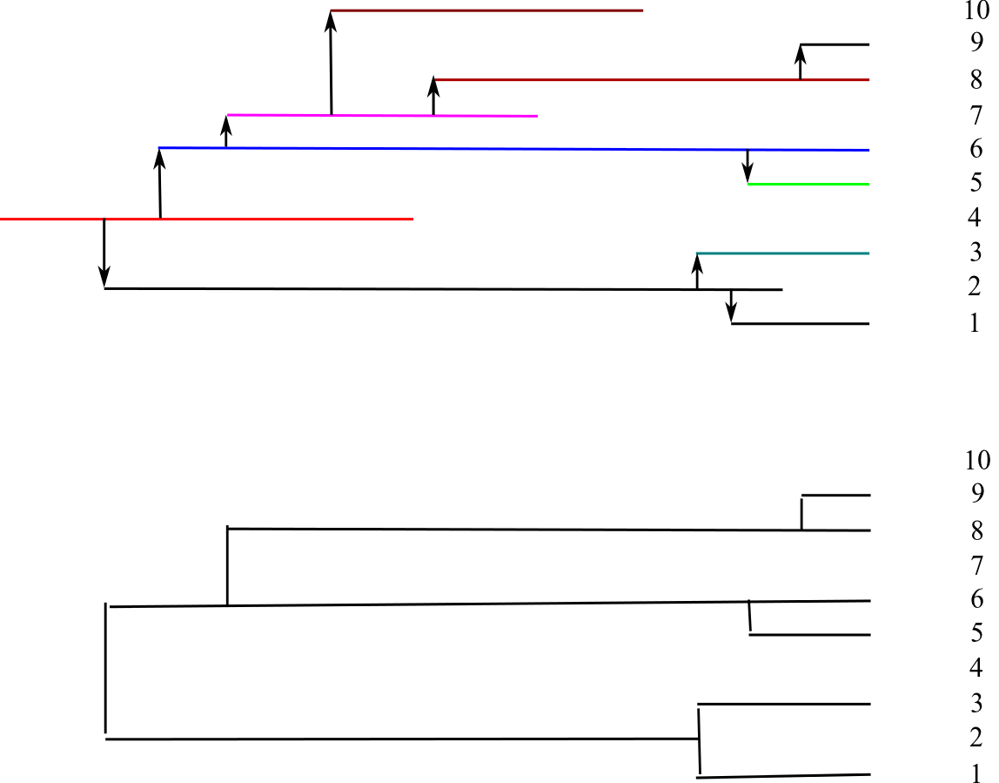

# Background

- In the context of viruses, molecular epidemiology is used to describe how we can make inferences about the transmission, distribution, etiology, and prevention of viral infections within a population
- Given the decreasing cost of sequencing, the use of molecular epidemiology to understand viruses is increasing

## Questions

- There are many questions that can be addressed with sequence data
    - When did an epidemic start?
    - How did an epidemic spread spatially, and between different risk groups?
    - What are the dynamics of transmission over time
- These questions involve reconstructing phylogenetic trees from sequence data

## Transmission and phylogenies

Ideally, we would like to know about the *transmission history* of a pathogen, but even in ideal cases, there is a loss of information in the phylogeny.

- No information before the common ancestor of the samples
- Direction of transmission is lost
- No information on individuals who have died/recovered before sampling
- We do not know which host is infected by which virus (except sampled individuals)
- Not all infection events are 'observed'

## Workflow

- A typical molecular epidemiology workflow is rather linear
    - Obtain sequences
    - Align
    - Screen for recombination, if necessary
    - Reconstruct phylogeny
    - Integrate phylogeny with other data (e.g. time, country)
    - Visualise results

## Problems

- There are many steps
- There are many software packages available to perform even a single part of this workflow

## Why R?

- Free, general purpose statistical software
- Many libraries (>4000), including those for sequence analysis
- Can call external programs
- Literate programming

## Why RStudio

- R runs in a terminal
- RStudio sits on top of R, and offers a number of additional features
  - Multiple windows for editing and running of code
  - Workspace browser
  - File browser
  - Integrated help
  - Graphics window

## What you'll (hopefully) learn

- Retrieving sequence data
- Obtaining sequence metadata
- Processing and altering sequence names
- Developing simple pipelines

## What you won't learn

- Processing of next-generation sequencing data
- BEAST

## Course structure

- Overall structure borrowed from [*The Phylogenetic Handbook, Second Edition*](http://www.cambridge.org/gb/academic/subjects/life-sciences/genomics-bioinformatics-and-systems-biology/phylogenetic-handbook-practical-approach-phylogenetic-analysis-and-hypothesis-testing-2nd-edition)
  - Brief theoretical background
  - Introduction to the practical implementation
  - Worked example
  - Exercises

## Next steps

Next, we'll go through a minimal example of generating a phylogeny. We'll do much more, both in terms of upstream analysis (data processing) and in downstream analysis (visualisation and interpretation) later.
