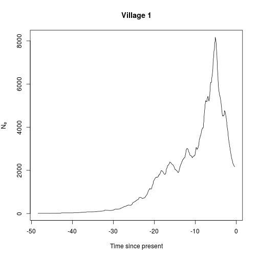

# Effective population size walkthrough


## Load libraries


```r
library(ape)
library(INLA)
source("ne.R")
```

## Fitting a 'skyride' model

Load tree.


```r
tree <- read.tree("Vill1_lsd.tre")
```

For some datasets, one may have to tweak the branch lengths to avoid repeated sample times/coalescent times, and ensure the tree is strictly bifurcating.


```r
tree <- multi2di(tree)
eps <- 0.001
tree$edge.length <- tree$edge.length+runif(1,-eps,eps)
tree$edge.length[tree$edge.length<0] <- eps
```

Fit skyride.


```r
tree.sr <- calculate.skyride(tree)
```

Plot


```r
plot(sr.median~time,data=tree.sr,xlab="Time since present",ylab=expression(N[e]),type="l",main="Village 1")
```

 

You may also want to plot time forwards rather than backwards.


```r
plot(sr.median~I(-time),data=tree.sr,xlab="Time since present",ylab=expression(N[e]),type="l",main="Village 1")
```

 

