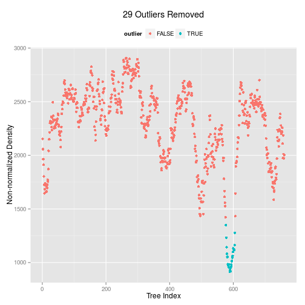
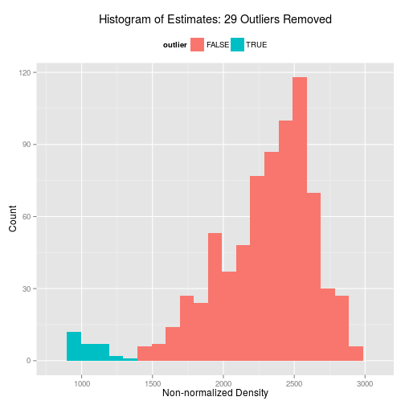
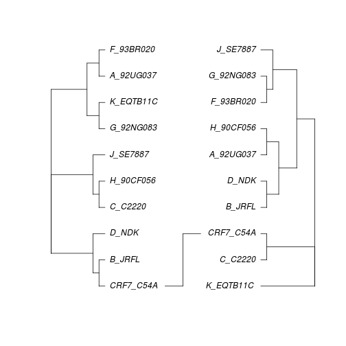
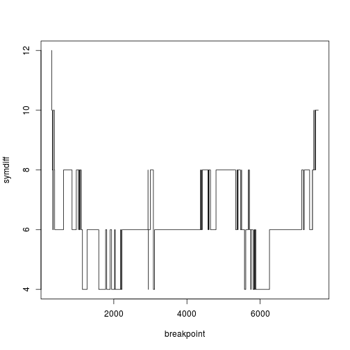

# Practice


## Prerequisites

### Load libraries


```r
library(ape)
library(stepwise)
library(magrittr)
library(kdetrees)
library(phangorn)
source("recombination.R")
```

In addition to the libraries, I have also written some functions:

- ```slidingWindowAlignment```: generates sliding window alignments
- ```sbtest```: generates trees either side of a breakpoint, and calculates the distance between the trees
- ```disttree```: calculates distances between all trees in a list

### Set filename and outgroup


```r
seqfilename <- "CRF7.fas"
outgroup <- "J_SE7887"
```

### Read FASTA file


```r
seqdata <- read.dna(seqfilename,format="fasta",as.matrix=TRUE)
seqdata
```

```
## 10 DNA sequences in binary format stored in a matrix.
## 
## All sequences of same length: 7894 
## 
## Labels: C_C2220 CRF7_C54A A_92UG037 B_JRFL D_NDK F_93BR020 ...
## 
## Base composition:
##     a     c     g     t 
## 0.366 0.173 0.236 0.225
```

### Output data with 'clean' sequence names in Phylip format

Some of the tests we will use need to have sequence data in Phylip format, so we use R to convert.


```r
seqdata.stepwise <- seqdata
row.names(seqdata.stepwise) <- makeLabel(row.names(seqdata),len=9)
write.dna(seqdata.stepwise,file=paste(seqfilename,".stepwise",sep=""),format="interleaved",colsep="",nbcol=-1)
```

## Test for recombination using Maxchi


```r
seqdata.maxchi <- maxchi(paste(seqfilename,".stepwise",sep=""),breaks=seg.sites(seqdata),winHalfWidth=50,permReps=100)
summary(seqdata.maxchi)
```

```
## --------------------------------------------------
## There were 12 site-specific MaxChi statistics significant at the
## 10 percent level (90th percentile = 21.007, 95th percentile = 22.243):
## 
## Number Location  MaxChi   pairs
##      1      293  23.645*   (B_JRFL    :G_92NG083 )
##      2      294  21.583*   (B_JRFL    :G_92NG083 )
##      3      297  23.377*   (B_JRFL    :G_92NG083 )
##      4      300  25.253*   (B_JRFL    :G_92NG083 )
##      5      301  23.377*   (B_JRFL    :G_92NG083 )
##      6      387  21.236*   (B_JRFL    :G_92NG083 )
##      7     6022  23.188*   (CRF7_C54A :G_92NG083 )
##      8     6084  21.374*   (C_C2220   :G_92NG083 )
##      9     6085  23.377*   (C_C2220   :G_92NG083 )
##     10     6090  21.374*   (CRF7_C54A :G_92NG083 )
##     11     6091  23.188*   (CRF7_C54A :G_92NG083 )
##     12     6092  21.374*   (C_C2220   :G_92NG083 )
## --------------------------------------------------
## Notes - "Location" is the polymorphic site just before the proposed breakpoint.
##       - MaxChi statistics significant at the 5 percent level indicated by a *
```

## Test for recombination using phylogenetic profiling

Running the same window and permutations using phylogenetic profiling.


```r
seqdata.phylpro <- phylpro(paste(seqfilename,".stepwise",sep=""),breaks=seg.sites(seqdata),winHalfWidth=50,permReps=100)
summary(seqdata.phylpro)
```

```
## Length  Class   Mode 
##      0   NULL   NULL
```

## Test for recombination using a sliding window phylogeny

We have already covered making a tree with a sequence alignment using a distance based approach, which involves making a distance matrix, performing tree reconstruction, perhaps rooting the tree, and plotting it out.

### Making a set of trees

As the sequences are stored in a matrix, it is straightforward to make a list of alignments, each of which is a window on the original alignment.

The following command generates sequence alignments 300 base pairs long, moving in steps of 10.


```r
seqdata.slide <- slidingWindowAlignment(seqdata,300,10)
length(seqdata.slide)
```

```
## [1] 760
```

This generates a list of alignments. In R, there is a command, ```lapply```, that applies a command to each element in a list. The following generates a list of distance matrices, then a list of neighbour joining trees.


```r
seqdata.slide.nj <- lapply(seqdata.slide,dist.dna,model="TN93",as.matrix=TRUE) %>%
  lapply(.,njs)
```

### Outlier detection

We now have a list of trees. How do we determine whether a single tree explains all the sub-alignments? One approach is to work out whether there are 'outlying trees'. The command ```kdetrees``` computes a distribution of trees, then determines whether there are trees in the 'tail' of the distribution. This requires an outgroup sequence to root the tree.


```r
seqdata.slide.nj.kde <- kdetrees(seqdata.slide.nj,outgroup=outgroup)
seqdata.slide.nj.kde
```

```
## Call: kdetrees(trees = seqdata.slide.nj, outgroup = outgroup)
## Density estimates:
##    Min. 1st Qu.  Median    Mean 3rd Qu.    Max. 
##   915.4  2071.0  2364.0  2272.0  2531.0  2906.0 
## Cutoff:  1380.953 
## 
## Outliers detected:
##  [1] 577 578 579 580 581 582 583 584 585 586 587 588 589 590 591 592 593
## [18] 594 595 596 597 598 599 600 601 602 603 604 605
```

Plotting out the output from this function will show the outlying trees, as a function of the index of the tree - each of which represents the tree from a slice of the original alignment.


```r
plot(seqdata.slide.nj.kde)
```

 

We can also plot out a histogram.


```r
hist(seqdata.slide.nj.kde)
```

 

Lets take two trees, one outlier, and one non-outlier.


```r
par(mfrow=c(1,2))
plot(seqdata.slide.nj[[200]])
plot(seqdata.slide.nj[[600]])
```

 

How are these different?

The command ```cophyloplot``` in ```ape``` allows us to plot two trees face-to-face in order to compare them more easily. This function takes the two trees as arguments, plus a matrix with the associations between the labels in the two trees - this is for cases where the labels in the trees may be different (e.g. comparing host and parasite phylogenies). In our case, the labels are the same.


```r
association <- matrix(c("CRF7_C54A","CRF7_C54A"),nrow=1,ncol=2)
cophyloplot(seqdata.slide.nj[[200]],seqdata.slide.nj[[600]],assoc=association)
```

 

## Single breakpoint test

A sliding window approach may be best if there are recombinant fragments, but if the sequences have a single recombinant breakpoint, then a different approach may be more powerful. This function splits the alignment into two (at least 300 base pairs long), and calculates the distance between the trees for either side of the breakpoint.


```r
seqdata.sbt <- sbtest(seqdata,300,"TN93")
```

Now we can plot the distance between the trees as a function of the breakpoint.


```r
plot(symdiff~breakpoint,data=seqdata.sbt,type="s")
```

 
