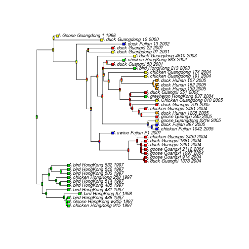

# 'Mugration' exercise


Load the libraries.


```r
library(ape)
library(phangorn)
library(ggtree)
```

```
## 
## Attaching package: 'ggtree'
## 
## The following objects are masked from 'package:IRanges':
## 
##     collapse, expand
## 
## The following object is masked from 'package:phangorn':
## 
##     getRoot
```

Load the FASTA data.


```r
myseqs <- read.dna("H5N1.fas",format="fasta")
```


```r
mytree  <- nj(dist.dna(myseqs,model="TN93"))
```

Starting with the neighbour joining tree, we reconstruct a maximum likelihood tree, as we did before. Note that we get a warning about negative branch lengths in the NJ tree, which aren't allowed in the ML tree.


```r
myseqs.phydat <- as.phyDat(myseqs)
myseqs.gtrig <- pml(mytree,myseqs.phydat,model="GTR+I+G",k=4)
```

```
## Warning in pml(mytree, myseqs.phydat, model = "GTR+I+G", k = 4): negative
## edges length changed to 0!
```

```r
myseqs.gtrig <- optim.pml(myseqs.gtrig,optNni=TRUE,optBf=TRUE,optQ=TRUE,optInv=TRUE,optGamma=TRUE,optEdge=TRUE,optRate=FALSE)
```

```
## optimize edge weights:  -6050.051 --> -6038.844 
## optimize base frequencies:  -6038.844 --> -5986.777 
## optimize rate matrix:  -5986.777 --> -5728.631 
## optimize invariant sites:  -5728.631 --> -5717.886 
## optimize shape parameter:  -5717.886 --> -5717.886 
## optimize edge weights:  -5717.886 --> -5717.684 
## optimize topology:  -5717.684 --> -5704.969 
## optimize topology:  -5704.969 --> -5704.969 
## 4 
## optimize base frequencies:  -5704.969 --> -5704.725 
## optimize rate matrix:  -5704.725 --> -5704.684 
## optimize invariant sites:  -5704.684 --> -5704.657 
## optimize shape parameter:  -5704.657 --> -5704.657 
## optimize edge weights:  -5704.657 --> -5704.657 
## optimize topology:  -5704.657 --> -5704.657 
## 0 
## optimize base frequencies:  -5704.657 --> -5704.655 
## optimize rate matrix:  -5704.655 --> -5704.655 
## optimize invariant sites:  -5704.655 --> -5704.655 
## optimize shape parameter:  -5704.655 --> -5704.655 
## optimize edge weights:  -5704.655 --> -5704.655 
## optimize base frequencies:  -5704.655 --> -5704.655 
## optimize rate matrix:  -5704.655 --> -5704.655 
## optimize invariant sites:  -5704.655 --> -5704.655 
## optimize shape parameter:  -5704.655 --> -5704.654 
## optimize edge weights:  -5704.654 --> -5704.654 
## optimize base frequencies:  -5704.654 --> -5704.654 
## optimize rate matrix:  -5704.654 --> -5704.654 
## optimize invariant sites:  -5704.654 --> -5704.654 
## optimize shape parameter:  -5704.654 --> -5704.654 
## optimize edge weights:  -5704.654 --> -5704.654 
## optimize base frequencies:  -5704.654 --> -5704.654 
## optimize rate matrix:  -5704.654 --> -5704.654 
## optimize invariant sites:  -5704.654 --> -5704.654 
## optimize shape parameter:  -5704.654 --> -5704.653 
## optimize edge weights:  -5704.653 --> -5704.653 
## optimize base frequencies:  -5704.653 --> -5704.653 
## optimize rate matrix:  -5704.653 --> -5704.653 
## optimize invariant sites:  -5704.653 --> -5704.653 
## optimize shape parameter:  -5704.653 --> -5704.653 
## optimize edge weights:  -5704.653 --> -5704.653 
## optimize base frequencies:  -5704.653 --> -5704.653 
## optimize rate matrix:  -5704.653 --> -5704.653 
## optimize invariant sites:  -5704.653 --> -5704.653 
## optimize shape parameter:  -5704.653 --> -5704.653 
## optimize edge weights:  -5704.653 --> -5704.653 
## optimize base frequencies:  -5704.653 --> -5704.653 
## optimize rate matrix:  -5704.653 --> -5704.653 
## optimize invariant sites:  -5704.653 --> -5704.653 
## optimize shape parameter:  -5704.653 --> -5704.652 
## optimize edge weights:  -5704.652 --> -5704.652 
## optimize base frequencies:  -5704.652 --> -5704.652 
## optimize rate matrix:  -5704.652 --> -5704.652 
## optimize invariant sites:  -5704.652 --> -5704.652 
## optimize shape parameter:  -5704.652 --> -5704.652 
## optimize edge weights:  -5704.652 --> -5704.652
```

```r
myseqs.mltree <- myseqs.gtrig$tree
```

We need to root the tree in order to do ancestral reconstruction. We could use ```rtt``` or ```lsd```, but in principle, we could use any method we discussed before. We scan the names of the tip labels, to get the tip dates and location.


```r
info <- scan(what=list(character(),character(),character(),character(),integer()),sep="_",quote="\"",text=paste(myseqs.mltree$tip.label,collapse="\n"),quiet=TRUE)
tipnames <- myseqs.mltree$tip.label
tipdates <- as.double(info[[5]])
tipdates
```

```
##  [1] 2005 2005 2002 2001 2005 2005 2004 2004 2003 2001 2000 1996 2005 2005
## [15] 2004 2004 2004 2004 2004 2004 2004 2004 2004 2001 2001 2004 2003 2002
## [29] 1998 1997 1997 1997 1997 1997 1997 1997 1997 1997 1997 2005 2005 2005
## [43] 2005
```

We can now root the tree and turn branch lengths into time using LSD.


```r
write.tree(myseqs.mltree,"H5N1.tre")
write.table(rbind(c(length(tipnames),""),cbind(tipnames,tipdates)),"H5N1.td",col.names=FALSE,row.names=FALSE,quote=FALSE)
```


```r
lsd.cmd <- sprintf("lsd -i %s -d %s -c -n 1 -r -b %s -s %s -v","H5N1.tre","H5N1.td",paste(10),seq.len)
lsd.cmd
```

```
## [1] "lsd -i H5N1.tre -d H5N1.td -c -n 1 -r -b 10 -s 6987 -v"
```

```r
lsd <- system(lsd.cmd,intern=TRUE)
```


```r
procresult <- function(fn){
  result <- readLines(fn)
  line <- result[grep("Tree 1 rate ",result)]
  line.split <- strsplit(line, " ")[[1]]
  list(rate=as.double(line.split[4]),tmrca=as.double(line.split[6]))
}
procresult("H5N1_result.txt")
```

```
## $rate
## [1] 0.003233
## 
## $tmrca
## [1] 1994.113
```


```r
lsd.tree <- read.tree("H5N1_result_newick_date.txt")
```

Now we can extract the location, and reconstruct the changes in state. Here is another R trick to parse sequence headers.


```r
info <- scan(what=list(character(),character(),character(),character(),integer()),sep="_",quote="\"",text=paste(lsd.tree$tip.label,collapse="\n"),quiet=TRUE)
info
```

```
## [[1]]
##  [1] "A" "A" "A" "A" "A" "A" "A" "A" "A" "A" "A" "A" "A" "A" "A" "A" "A"
## [18] "A" "A" "A" "A" "A" "A" "A" "A" "A" "A" "A" "A" "A" "A" "A" "A" "A"
## [35] "A" "A" "A" "A" "A" "A" "A" "A" "A"
## 
## [[2]]
##  [1] "chicken"   "Goose"     "bird"      "bird"      "bird"     
##  [6] "bird"      "bird"      "chicken"   "bird"      "bird"     
## [11] "bird"      "duck"      "goose"     "goose"     "goose"    
## [16] "duck"      "duck"      "chicken"   "swine"     "chicken"  
## [21] "duck"      "goose"     "goose"     "duck"      "chicken"  
## [26] "duck"      "Chicken"   "greyheron" "duck"      "duck"     
## [31] "duck"      "duck"      "chicken"   "chicken"   "bird"     
## [36] "duck"      "chicken"   "duck"      "duck"      "duck"     
## [41] "duck"      "duck"      "Goose"    
## 
## [[3]]
##  [1] "HongKong"  "HongKong"  "HongKong"  "HongKong"  "HongKong" 
##  [6] "HongKong"  "HongKong"  "HongKong"  "HongKong"  "HongKong" 
## [11] "HongKong"  "Guangxi"   "Guangxi"   "Guangxi"   "Guangxi"  
## [16] "Guangxi"   "Guangxi"   "Guangxi"   "Fujian"    "Fujian"   
## [21] "Fujian"    "Guangdong" "Guangxi"   "Hunan"     "Guangxi"  
## [26] "Guangxi"   "Guangdong" "HongKong"  "Guangxi"   "Hunan"    
## [31] "Hunan"     "Hunan"     "Guangdong" "Guangdong" "HongKong" 
## [36] "Guangxi"   "HongKong"  "Guangdong" "Guangdong" "Guangxi"  
## [41] "Fujian"    "Guangdong" "Guangdong"
## 
## [[4]]
##  [1] "915"  "w355" "488"  "97"   "481"  "485"  "514"  "258"  "503"  "542" 
## [11] "532"  "1378" "914"  "1097" "2112" "2291" "1681" "2439" "F1"   "1042"
## [21] "897"  "2216" "345"  "1265" "2461" "793"  "810"  "837"  "351"  "139" 
## [31] "182"  "157"  "191"  "174"  "213"  "50"   "863"  "4610" "01"   "22"  
## [41] "13"   "12"   "1"   
## 
## [[5]]
##  [1] 1997 1997 1997 1998 1997 1997 1997 1997 1997 1997 1997 2004 2004 2004
## [15] 2004 2004 2004 2004 2001 2005 2005 2005 2005 2005 2004 2005 2005 2004
## [29] 2004 2005 2005 2005 2004 2004 2003 2001 2002 2003 2001 2001 2002 2000
## [43] 1996
```

The location is the third entry in the list.


```r
mylocation <- as.factor(info[[3]])
mylocation
```

```
##  [1] HongKong  HongKong  HongKong  HongKong  HongKong  HongKong  HongKong 
##  [8] HongKong  HongKong  HongKong  HongKong  Guangxi   Guangxi   Guangxi  
## [15] Guangxi   Guangxi   Guangxi   Guangxi   Fujian    Fujian    Fujian   
## [22] Guangdong Guangxi   Hunan     Guangxi   Guangxi   Guangdong HongKong 
## [29] Guangxi   Hunan     Hunan     Hunan     Guangdong Guangdong HongKong 
## [36] Guangxi   HongKong  Guangdong Guangdong Guangxi   Fujian    Guangdong
## [43] Guangdong
## Levels: Fujian Guangdong Guangxi HongKong Hunan
```

We fix any small branch lengths.


```r
lsd.tree$edge.length[lsd.tree$edge.length<0.00000001] <- 0.00000001
```

Now perform ancestral reconstruction of the location; I use a simple equal rates model (```model="ER"```), although in principle I could use more complex ones.


```r
lsd.tree.ace <- ace(mylocation,lsd.tree,type="discrete",method="ML",model="ER")
```


```r
lsd.tree.ace
```

```
## 
##     Ancestral Character Estimation
## 
## Call: ace(x = mylocation, phy = lsd.tree, type = "discrete", method = "ML", 
##     model = "ER")
## 
##     Log-likelihood: -45.57865 
## 
## Rate index matrix:
##           Fujian Guangdong Guangxi HongKong Hunan
## Fujian         .         1       1        1     1
## Guangdong      1         .       1        1     1
## Guangxi        1         1       .        1     1
## HongKong       1         1       1        .     1
## Hunan          1         1       1        1     .
## 
## Parameter estimates:
##  rate index estimate std-err
##           1   0.0701  0.0151
## 
## Scaled likelihoods at the root (type '...$lik.anc' to get them for all nodes):
##     Fujian  Guangdong    Guangxi   HongKong      Hunan 
## 0.02836587 0.20304071 0.02992778 0.71128212 0.02738351
```


```r
plot(lsd.tree, type="p",label.offset=0.0025,cex=0.75)
co <- c("blue", "yellow","red","green","orange")
tiplabels(pch = 22, bg = co[as.numeric(mylocation)], cex = 1.0)
nodelabels(thermo = lsd.tree.ace$lik.anc, piecol = co, cex = 0.25)
```

 

The next steps in this analysis could be:
- To explore different possible models for the migration process
- To perform a joint trait/tree analysis in BEAST (see [here](https://github.com/sdwfrost/influenza-dynamics-practical-h5n1) for an analysis of the same data)
- To develop more complex structured coalescent models e.g. in ```rcolgem```
